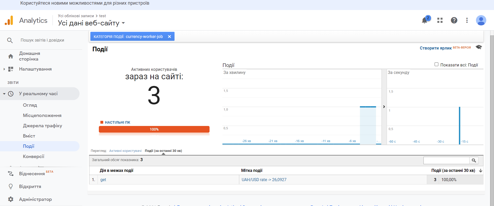

# highload-sw-arch-hw-03

# Prerequisites
* docker
* linux + bash

# 1. Set GOOGLE_ANALYTICS_TRACKING_ID in .env file

# 2. Build + run application
```
./run.sh
```

# 3. Observe results in google analytics

